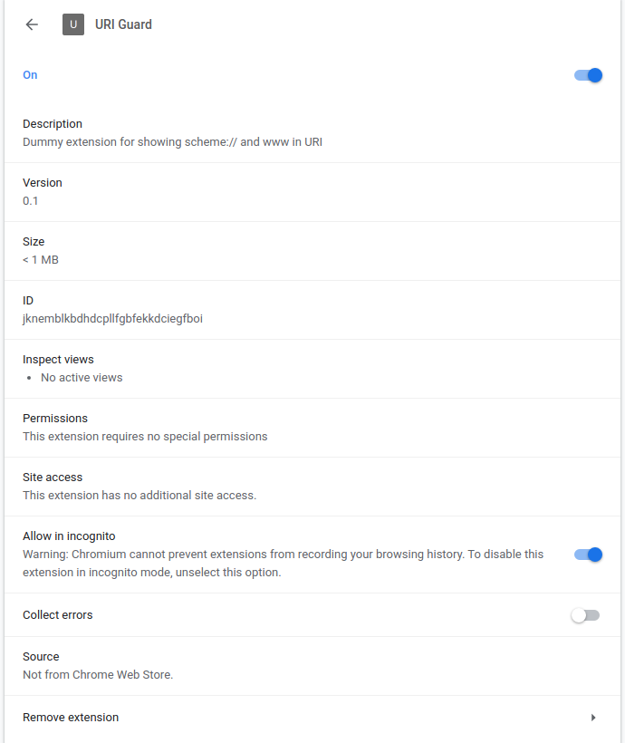

# Chrome URI patcher (URI Guard)

Patch chrome/chromium Preferences to create a dummy extension for showing `scheme://` and `www.**` in URI.

I know an extension called [Suspicious Site Reporter](https://chrome.google.com/webstore/detail/suspicious-site-reporter/jknemblkbdhdcpllfgbfekkdciegfboi?hl=en-US) can do this, but it comes with extra codes, triggers, and scripts, which I don't want to see.

## Usage

**IF YOU HAVE INSTALLED THE [Suspicious Site Reporter](https://chrome.google.com/webstore/detail/suspicious-site-reporter/jknemblkbdhdcpllfgbfekkdciegfboi?hl=en-US), YOU MUST REMOVE IT FIRST.**

**CLOSE CHROME/CHROMIUM**

then run:

```
$ ./patcher.py <path_to_chrome_profile_preferences_file>
```

for example,

```
$ ./patcher.py "${HOME}/.config/google-chrome/Default/Preferences"
Preferences has been backup to /tmp/chrome_pfile_backup
Loading preferences...
Patching preferences...
```

> Your Chrome profile path may not be at this location. Chrome Dev might be at "$ {HOME}/.Config/google-chrome-unstable/Default/Preferences", and Chromium might be at "${HOME}/.Config/chromium/Default/Preferences"
>
> If a problem occurs, you can restore the file with the backup file

enjoy.



# 中文说明：Chrome URI 修补器 (URI 卫士)

修补 chrome/chromium 的 Preferences，创建一个傀儡扩展来在 URI 中显示 `scheme://` 和 `www.**`.

我知道一个叫 [Suspicious Site Reporter](https://chrome.google.com/webstore/detail/suspicious-site-reporter/jknemblkbdhdcpllfgbfekkdciegfboi?hl=en-US) 的扩展程序可以做到这一点，但是它带有额外的代码、触发器和脚本，这是我不希望看到的。

## 使用方法

**如果你已经安装了 [Suspicious Site Reporter](https://chrome.google.com/webstore/detail/suspicious-site-reporter/jknemblkbdhdcpllfgbfekkdciegfboi?hl=en-US), 必须卸载它.**

**关闭 Chrome 或者 Chromium**

然后运行:

```
$ ./patcher.py <path_to_chrome_profile_preferences_file>
```

一个例子,

```
$ ./patcher.py "${HOME}/.config/google-chrome/Default/Preferences"
Preferences has been backup to /tmp/chrome_pfile_backup
Loading preferences...
Patching preferences...
```

> 你的 Chrome profile 路径未必在这个位置。Chrome Dev 可能在 "${HOME}/.config/google-chrome-unstable/Default/Preferences"，而 Chromium 可能在 "${HOME}/.config/chromium/Default/Preferences"
>
> 如果发生问题，你可以用备份的文件进行恢复

享受
